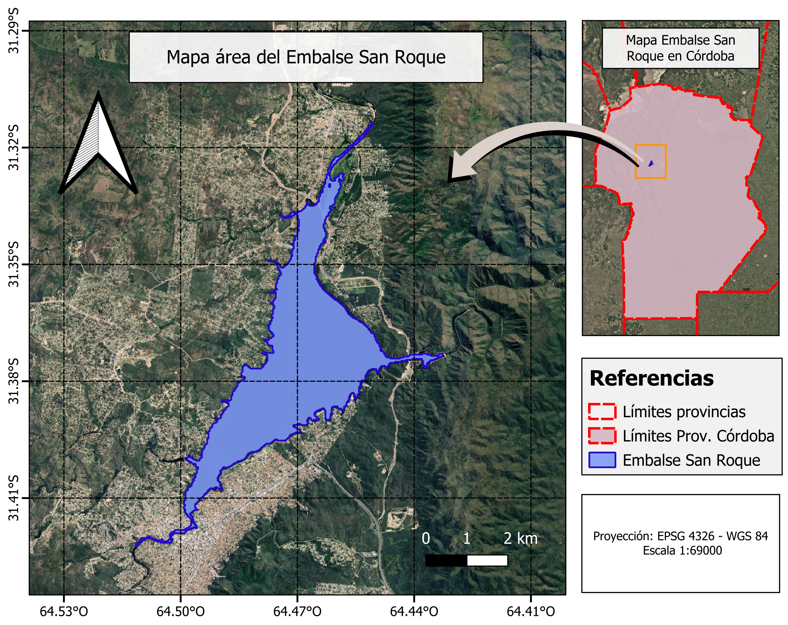
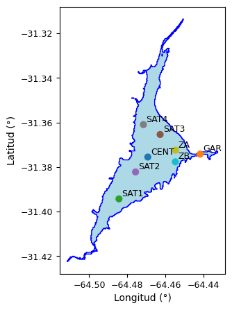
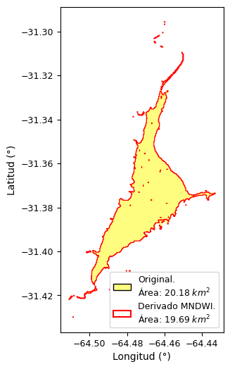
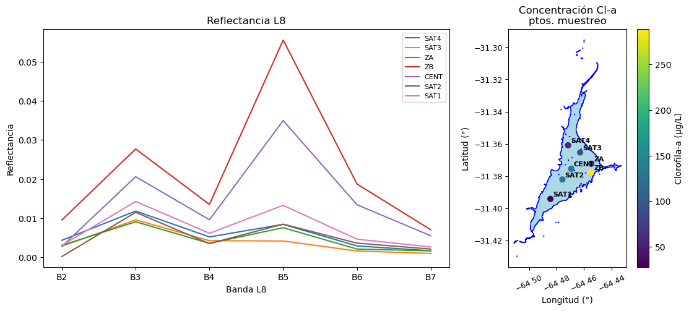
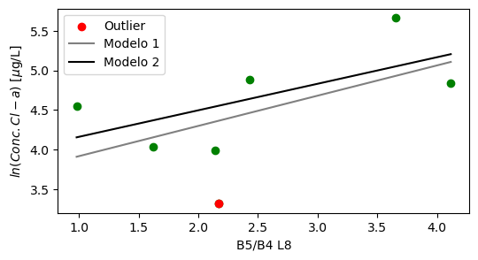
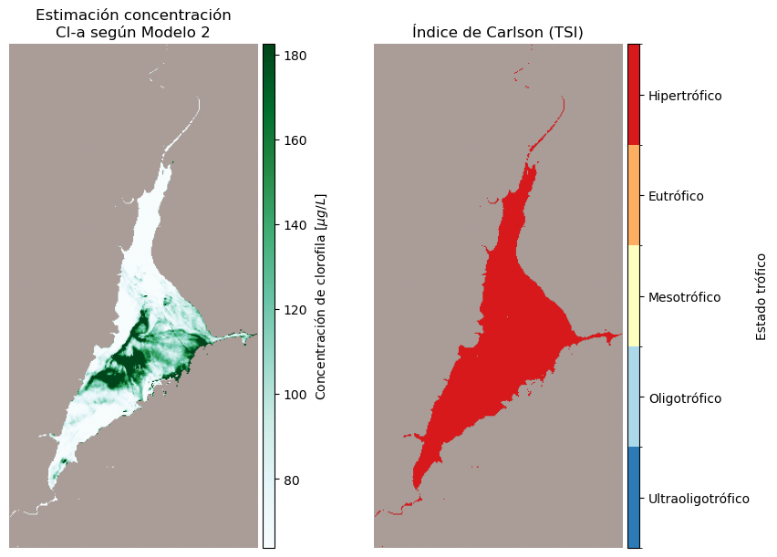

\Large

**Trabajo práctico N°2. Elaboración de mapas de Clorofila-a a partir de imágenes Landsat y mediciones de campo**

**Materia:** Teledetección Ambiental (Maestría en Aplicaciones de Información Espacial, I. Gulich)

**Docentes:** Dra. Fernanda García, Dra. Anabella Ferral y Dr. Juan Argarañaz

**Alumno:** Franco David Barrionuevo

**Año:** 2026

\normalsize

---

# 1. Introducción

## 1.1. Floraciones algales en el Embalse San Roque

La eutrofización es un proceso mediante el cual aumenta la producción primaria de un cuerpo de agua como consecuencia del ingreso de cantidades elevadas de materia orgánica y nutrientes, entre ellos fósforo y nitrógeno. Como resultado, bajo condiciones adecuadas, puede producirse un incremento de la biomasa algal, lo que suele denominarse floración (o *bloom*) algal (Wetzel, 2001).

La clorofila-a (Cl-a) es un pigmento característico de las especies vegetales y de las microalgas. La medición de su concentración se utiliza como un indicador de la biomasa algal, así como del estado trófico de un cuerpo de agua (Carlson, 1977).

El Emblase San Roque es un dique artificial ubicado en la provincia de Córdoba, Argentina, donde las frecuentes condiciones de eutrofización favorecen la ocurrencia de una elevada producción de algas. Debido a su gran extensión, realizar un muestreo convencional para evaluar su estado no resulta suficiente. Ante esta situación, el empleo de datos satelitales para su monitoreo surge como una alternativa que ha mostrado resultados satisfactorios en este embalse (Ferral et al., 2017).

## 1.2. Evaluación de la Cl-a mediante imágenes satelitales

De acuerdo con Germán et al. (2019), se ha encontrado mediante modelos empíricos, una alta correlación entre las bandas roja (Red) y del infrarrojo cercano (NIR), y la concentración de Cl-a en aguas eutrofizadas. Esto se debe a la alta absorción de este pigmento alrededor de los 670 nm y al pico de reflectancia de las células algales alrededor de los 700 nm. Conociendo este comportamiento, es posible elaborar modelos semiempíricos que relacionen la reflectancia en dichos rangos del espectro electromagnético, medida por los sensores a bordo de los satélites, con datos de campo de concentración de clorofila-a.

# 2. Objetivo

El objetivo de este trabajo consistió en la elaboración de un modelo semiempírico que relaciona las reflectancias de las bandas roja (Red) y del infrarrojo cercano (NIR), obtenidas a partir de una escena Landsat 8, con datos de campo de concentración de clorofila-a en el Embalse San Roque para una fecha específica. Una vez generado el modelo, se estimó la concentración de este pigmento en toda la extensión del embalse, lo que permitió evidenciar el potencial de los datos satelitales para la evaluación de un evento de *bloom* algal.

# 3. Metodología

## 3.1. Área de estudio

El área de estudio corresponde al Embalse San Roque (ESR), ubicado en la ciudad de Villa Carlos Paz, provincia de Córdoba, Argentina (**Figura 1**). El embalse se localiza aproximadamente a los 31.37° S y 64.47° O, a una altitud de 643 m s.n.m.

{ width=55% }

## 3.1. Fuente de datos

Se empleó una escena Landsat 8 (L8) con nivel de procesamiento 2, que incluye las bandas 1 a 7, adquirida el 22 de febrero de 2017 (**Figura 1**). La escena abarca la ciudad de Córdoba y sus alrededores (provincia de Córdoba, Argentina) [Path: 229; Row: 082] y fue obtenida a través de la plataforma [Earth Explorer](https://earthexplorer.usgs.gov/).

Por otro lado, se utilizó una capa vectorial correspondiente a los límites del Embalse San Roque (Lat. Centroide: -31.37°, Lon. Centroide: -64.47°). Además, se contó con una dataset de correspondiente a las mediciones de concentración de clorofila-a realizadas el mismo día de adquisición de los datos por L8 en los puntos de muestreo (**Figura 2**).

{ width=30% }

## 3.2. Procesamiento de los datos

Tanto la escena de L8, así como los datos vectoriales fueron enteramente procesados mediante scripts desarrollados en Python. Las operaciones de algebra de bandas, stackeado de bandas, clipping, así cómo extracción de datos de reflectancia se realizaron empleando las librerías *numpy*, *rasterio*, *pandas* y *geopandas*. El ajuste del modelo semiempirico se realizó empleando la funcion *OLS* de *Stats Models*. Los códigos se encuentran públicos en el siguiente [repositorio de GitHub](https://github.com/francobarrionuevoenv21/MAIE_devs_pub/tree/main/Teledt_ambiental/TP2_Clorofila-a).

### 3.2.1. Actualización límites del Embalse San Roque

Debido a las variaciones que puede experimentar el embalse, como cambios en su nivel de agua, los límites del cuerpo de agua se actualizaron a partir de la escena Landsat 8 adquirida el 22 de febrero de 2017. Para ello, se calculó el Índice de Agua de Diferencia Normalizada Modificado (MNDWI, por sus siglas en inglés), propuesto por Xu (2006). Este índice reemplaza la banda del infrarrojo cercano (NIR) por la del infrarrojo de onda corta (SWIR) (**Ecuación 1**), aprovechando la menor reflectancia del agua en esta región del espectro respecto de la vegetación y las áreas urbanas. De esta manera, permite discriminar con mayor precisión los cuerpos de agua, debido a que las demás coberturas se caracterizan por valores de NDWI inferiores a 0.

\begin{equation}
MNDWI = \frac{Green - SWIR}{Green + SWIR}
\end{equation}

### 3.2.2. Datos de reflectancia y ajuste de un modelo semiempírico

Para cada uno de los puntos de muestreo sobre los cuales se disponía de mediciones de concentración de clorofila-a en campo (**Figura 2**), se extrajeron los valores de reflectancia de la escena Landsat 8 para las bandas 1 a 7. A partir de estos datos, se generó una variable derivada correspondiente a la relación entre las bandas 5 (NIR) y 4 (Red). Empleando la relación B5/B4 como variable explicativa y la concentración de clorofila-a medida en campo como variable respuesta, se ajustó un modelo de regresión lineal. Finalmente, el modelo obtenido se utilizó para estimar la concentración de clorofila-a en toda la extensión del Embalse San Roque a partir de la relación entre las reflectancias de las bandas 5 y 4.

Finalmente, a partir de las estimaciones de la concentración de clorofila-a, se elaboró un mapa del estado trófico del ESR. Para ello, se empleó el Índice de Estado Trófico (TSI, por sus siglas en inglés) propuesto por Carlson, calculado a partir de la **Ecuación 2**. De acuerdo con este índice, valores entre 0 y 20 corresponden a un estado *ultraoligotrófico*; entre 20 y 40, *oligotrófico*; entre 40 y 50, *mesotrófico*; entre 50 y 70, *eutrófico*; y superiores a 70, *hipertrófico*.

\begin{equation}
TSI = 9.81 \ln(\text{Cl-a}) + 30,6
\end{equation}

# 4. Resultados y discusión

## 4.1. Actualización límites de Lago San Roque

La actualización de los límites del ESR mediante el índice MNDWI dio como resultado un área ligeramente menor que la original. De esta forma, el área total pasó de 20,18 $km^{2}$ a 19,69 $km^{2}$ (**Figura 3**). Si bien no es posible determinar si esta diferencia se debe a cambios en las condiciones físicas del embalse, el procedimiento asegura que la predicción de la concentración de clorofila-a se realice únicamente sobre la superficie de agua definida por valores de $MNDWI > 0$ en la escena Landsat 8 utilizada.

{ width=30% }

## 4.2. Datos ajuste del modelo

El ajuste del modelo semiempírico para la predicción de la concentración de clorofila-a en el ESR se realizó empleando los datos de reflectancia de Landsat 8 y las mediciones de concentración de este pigmento obtenidas en campo, ambos correspondientes a la misma fecha. Se destaca que el punto denominado *GAR* (Garganta) fue excluido del análisis debido a que el píxel asociado contiene una mayor proporción de suelo que de agua.

Las reflectancias medidas en la mayoría de los sitios de muestreo presentaron firmas espectrales similares a las de la vegetación, con un pico en el rango del verde, un valle de alta absorción en la banda roja (B4) y un aumento de la reflectancia en la banda del infrarrojo cercano (B5). Se destacan los elevados valores de reflectancia registrados en los sitios *SAT1*, *SAT2* y *ZB*. La excepción corresponde al punto *SAT3*, cuya firma espectral es característica de un cuerpo de agua (**Figura 4, izquierda**). Por otro lado, como se observa en la **Figura 4 (derecha)**, las mayores concentraciones de clorofila-a se registraron en los puntos *SAT2*, *CENT* y *ZB*, destacándose este último con una concentración superior a 250 $\mu g/L$.

En general, como primer análisis de los resultados, se observa que tanto las concentraciones de clorofila-a medidas en campo como las firmas espectrales obtenidas presentan un comportamiento coherente con lo esperado. En particular, un aumento en la concentración de clorofila-a se asocia con un incremento de la reflectancia y la relación NIR/Red, así como una transición desde una firma espectral típica del agua hacia otra similar a la de la vegetación. 

{ width=90% }

## 4.3. Ajuste del modelo semiempírico

Habiendo recopilado los datos de reflectancia y de concentración de clorofila-a correspondientes a los siete puntos de muestreo, se procedió al ajuste de un modelo lineal. Para ello, se definió como variable predictora la relación entre las reflectancias en las bandas roja y del infrarrojo cercano (NIR), representada como *B5/B4* según la numeración de bandas de Landsat 8. Como variable respuesta se utilizó el logaritmo de la concentración de clorofila-a, ya que esta es la variable de interés a estimar sobre toda la extensión del ESR a partir de su función inversa.

Se optó por un modelo de regresión lineal, cuyo ajuste se realizó mediante la función *OLS* de la librería *StatsModels* de Python. En una primera instancia, se ajustó un modelo preliminar utilizando los datos de los siete puntos de muestreo. Posteriormente, a partir de un análisis exploratorio, se identificó al punto correspondiente a la estación *SAT1* como un *outlier*. En consecuencia, se ajustó un segundo modelo, el cual presentó un mayor coeficiente de determinación ($R^{2}$). Los modelos obtenidos y sus respectivos parámetros se presentan en la **Figura 5** y el **Cuadro 1**, respectivamente.

{ width=70% }

| Modelo | b | m | p-valor (m) | $R^{2}$ | Observación |
|:-------|------------:|--:|--:|--:|--------:|
| *M1* | 3.54 | 0.38 | 0.20 | 0.30 | Incluye los 7 ptos. de muestreo |
| *M2* | 3.82 | 0.33 | 0.17 | 0.41 | Excluye el sitio *SAT 1* |

Table: Parámetros de los modelos lineales ajustados para la estimación de la concentración de clorofila-a en el Embalse San Roque. {#tbl:modelos}

Tal como se observa en el **Cuadro 1**, el segundo modelo presentó un mayor coeficiente de determinación ($R^{2}$). Sin embargo, en ninguno de los dos casos fue posible rechazar la hipótesis nula evaluada sobre la pendiente de la recta, dado que en ambos modelos se obtuvo un *p*-valor superior a 0,05. Ante este escenario, se optó por utilizar el modelo 2 (*M2*) para estimar la concentración de clorofila-a en el ESR, debido a su mejor coeficiente de ajuste. Para incrementar la confiabilidad de los modelos, para futuros trabajos será necesario aumentar el número de datos de muestreo.

## 4.4. Predicción de la concentración de clorofila

Empleando el modelo que quedó definido tal como se muestra en la **Ecuación 3**, se realizó la predicción de la concentración de clorofila en el ESR. Para ello se generó una matriz 2D de datos correspondientes a la relación entre las bandas *B5/B4*, la cual fue recortada según los límites actualizados del lago (ver ítem 3.1). El resultado para cada pixel se computó como el $log(Conc. Cl-a)$ que posteriormente se convirtió a concentración de clorofila mediante su función inversa. 

\begin{equation}
log(Conc. Cl-a) = 0.33*(B5/B4) + 3.82
\end{equation}

Debido a que el modelo ajustado solo es válido dentro del dominio en el cual fue ajustado (**Figura 5**), se definieron umbrales. Es decir en aquellos pixeles donde se que cumplía la relación *B5/B4 < 0.98* se le asignó la concentración mínima que devuelve el modelo. Mientras que para aquellos en los cuales se cumplía que la relación *B5/B4 > 4.11*, se le asignó el valor máximo. A partir de estos resultados, luego, fue posible calcular el TSI y su categorización según el estado de eutrofización de cada pixel. El resultado final se muestra en los mapas de la **Figura 6**. 

{ width=85% }

Tal como se muestra en la figura anterior, la concentración de clorofila predicha en el ESR estuvo en el rango entre los 63 y 182 $\mu$$g/L$. Si se compara con los valores medidos en los puntos de muestreo, se observa una subestimación. Esto se explica, entre otros factores, a las restricción que presentó el modelo elegido. Entre ellas el bajo $R^{2}$. De todas formas, los resultados obtenidos si lograron capturar el patrón observado en el análisis preliminar de los datos (ver ítem 3.2), donde la mayor concentración del pigmento se halla en el centro y su orilla este. Respecto al Índice de Carlson, los resultados obtenidos arrojan que la totalidad del embalse en la fecha analizada se encontraba en un estado hipertrófico. Según lo discutido anteriormente, dicho estado se obtuvo aun subestimando la concentración de clorofila. En este sentido, lo que se deduce es que el estado trófico del ESR pudo haber sido de una menor calidad del agua que el estimado. 

# 5. Referencias

\begin{small}

Carlson, R. E. (1977). A trophic state index for lakes. Limnology and Oceanography, 22, 361--369.https://doi.org/10.4319/lo

.1977.22.2.0361

Ferral, A., Solis, V., Frery, A., Orueta, A., Bernasconi, I., Bresciano, J., \& Scavuzzo, C. M. (2017). Spatio-temporal changes in water quality in an eutrophic lake with artificial aeration. Journal of Water and Land Development, 35, 27--40. https://doi.org/10.1515/jwld-2017-0065

German, A., Ferral, A., Scavuzzo, C., Alarcón, A., Tropper, I., Ibáñez, G., Torrusio, S., \& Shimoni, M. (2019). Spectral monitoring of algal blooms in an eutrophic lake using Sentinel-2. In Proceedings of the IEEE International Geoscience and Remote Sensing Symposium (IGARSS 2019) (pp. 5996--5999). IEEE. https://doi.org/10.1109/IGARSS.2019.8898098

Wetzel, R. G. (2001). Limnology: Lake and River Ecosystems (3rd ed.). Academic Press.

Xu, H. (2006). Modification of Normalized Difference Water Index (NDWI) to Enhance Open Water Features in Remotely Sensed Imagery. International Journal of Remote Sensing, 27, 3025--3033. https://doi.org/10.1080/01431160600589179

\end{small}