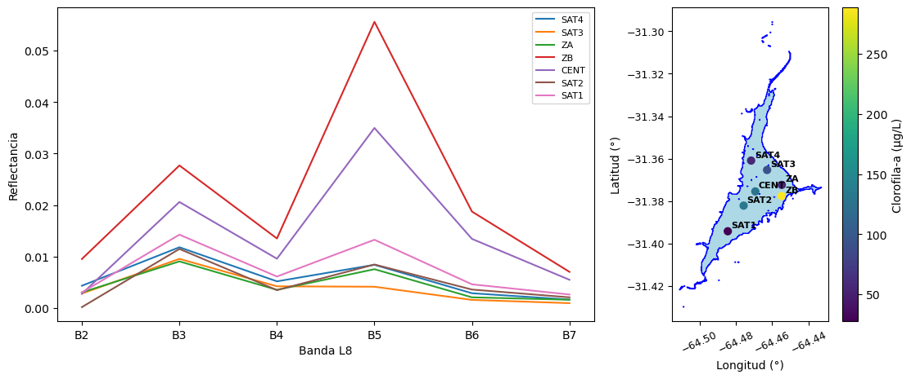
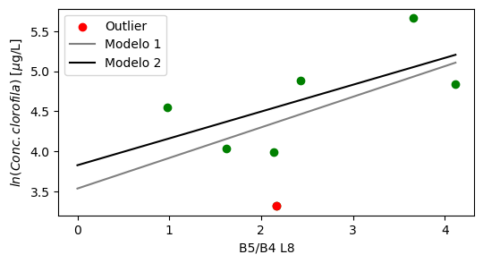
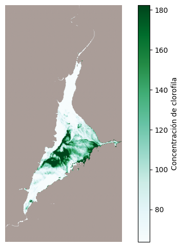

# 1. Objetivo

# 2. Metodología

## 2.1. Fuente de datos

Se ha empleado una escena de Landsat 8 (L8) con nivel de procesamiento 2, incluyendo las bandas 1 a 7, obtenida el día 22 de febrero del año 2017 **(Figura X)**. Esta abarca el área de la Ciudad de Córdoba y alrededores (Provincia de Córdoba, Argentina) [Path: 229; Row: 082] . La misma se adquirió a través de a plataforma [Earth Explorer](https://earthexplorer.usgs.gov/). Por otro lado se ha trabajado con una capa vectorial correspondiente a los límites del Lago San Roque (Lat. Centroide: -31.37°, Lon. Centroide: -64.47°; **Figura X)**. Adicionalmente, se incluyó un segundo archivo vectorial que incluía los puntos de muestreo sobre el Lago San Roque y las correspondientes mediciones de concentración de clorofila realizadas el día 22 de febrero del año 2017.

{ width=18% }
**Figura X**. ---

## 2.2. Procesamiento de los datos

Tanto la escena de L8, así como los archivos vectoriales fueron enteramente procesados mediante scripts desarrollados en Python. Las operaciones de algebra de bandas, stackeado de bandas, clipping, así cómo extracción de datos de reflectancia se realizaron empleando las librerías *numpy*, *rasterio*, *pandas* y *geopandas*. El ajuste del modelo semiempirico se realizó empleando la funcion *OLS* de *Stats Models*. Los códigos se encuentran públicos en el siguiente [repositorio de GitHub](https://github.com/francobarrionuevoenv21/MAIE_devs_pub/tree/main/Teledt_ambiental/TP2_Clorofila-a).

### 2.2.1. Actualización límites del Lago San Roque

Debido a las variaciones que puede sufrir el lago, como por ejemplo cambios en el su nivel, se han actualizado los límites del cuerpo de agua. Para ello se ha computado e índice Índice de Agua de Diferencia Normalizada Modificada (MNDWI) **(Ecuación X)** a partir de la escena de L8 adquirida el 22 de febrero del año 2017. Se han enmascarado los valores menores a 0, y finalmente se ha vectorizado el resultado

$MNDWI = \frac{Green-SWIR}{Green+SWIR}$ **Ecuacion X**

### 2.2.2. Datos de reflectancia y ajuste de un modelo semiempírico

Para cada de unos de los puntos de muestreo sobre los cuales se contaba con datos de medición en campo de la concentración de clorofila **(FIGURA X)**, se han extráido los valores de valores de reflectancia de la escena de L8 para las bandas 1 a 7. A partir de ellos, luego se elaboró un *feature* derivado a partir de la relación entre las bandas 5 y 4 (B5/B4). Empleando los datos de B5/B4 como variable explicativa y la concentración de clorofila medida en campo como variable explicada, se ajustó un modelo de regresión lineal. A partir de este modelo, luego se predijo la concentración de clorofila dentro del Lago San Roque a partir de relación entre las reflectancias de las bandas 5 y 4. 

# 3. Resultados

## 3.1. Actualización límites de Lago San Roque

La actualización de los límites del LSR empleando el índice MNDWI, dió cómo resultado un área levemente un poco menor al del original. De esta forma, se pasó de un área computada total de 20,18 $km^{2}$ a 19,69 $km^{2}$ **(FIGURA X)**. Si bien, no es posible concluir sobre si esta diferencia se debe a cambios en las condiciones físicas del lago, se garantiza que la predicción de la concentración de clorofila en el LSR se hará sobre la superficie de agua definida como aquella con $MDNWI > 0$ a partir de la escena de L8 utilizada.

{ width=18% }
**Figura X**. ---

## 3.2. Datos ajuste del modelo

El ajuste del modelo semiempírico para la predicción de la concentración de clorofila en el LSR, como se ha mencionado, se ha realizado empleando los datos de reflectancia de Landsat 8 y los datos medidos en campo de la concetración de este microorganismo, ambos corresponden a mediciones realizadas la misma fecha. Se menciona que el dato del punto denominado como GAR (Garganta) fue excluido debido a que el pixel contiene una mayor proporción de suelo que de agua. Tal como se observa en la **FIGURA X (Derecha)**, la mayor concentración de clorofila se midió en los puntos *SAT2*, *CENT*, y *ZB*, destacándose este último con una concentración medida mayor a 250 $\mu$$g/L$.

La reflectancia medida en en la mayoría los sitios de muestreo presentaron firmas espectrales asimilables a la de la vegetación, con un pico en el rango del verde, un valle de alta absorción en la banda del rojo (B4) y un pico en la banda del NIR (B5). Se destacan la alta reflectancia relativa registrada en los sitios *SAT1*, *SAT2* y *ZB*. La excepción la cumple el punto *SAT3* que presenta una firma típica de agua **FIGURA X (Izquierda)**

En general, a modo de primer análisis de los resultados, se puede observar que los valores medidos tanto para la concentración de cianobacterias como la reflectancia guardan coherencia con lo esperado. Es decir, a mayor concentración de clorofila, debería aumentar la reflectancia y virar de una firma espectral de agua a una asimilable a vegetación. Este supuesto es que posteriormente se utilizó para ajustar el modelo semiempírico. 

{ width=60% }
**Figura X**. ---

## 3.3. Ajuste del modelo semiempírico

Habiendo recopilado tanto los datos de reflectancia como los de concentración de clorofila para los 7 puntos de muestreo, se prosiguió con el ajuste de un modelo lineal. Para ello se definió como variable predictora la relación entre las reflectancias en el rojo y el NIR, que definió como *B5/B4* según el número de banda de L8. La variable predicha fue el logaritmo de la concentración microorganismos, que es lo que sea conocer sobre toda la extensión del LSR. 

Se eligió un modelo de ajuste lineal, lo cual se realizó empleando la función de *OLS* de la librería *Stats Models* de Python. Primero, se ajustó un modelo preliminar incluyendo los datos de los 7 puntos de muestreo. Luego, análisis exploratorio mediante, se identificó como punto outlier al correspondiente a la estación *SAT 1*. De esta forma, se ajustó un segundo modelo que presentó un mejor coeficiente de determinación ($R^{2}$). Los modelos generados y los parámetros de cada uno se presentan en la **Figura X** y **Tabla X**, respectivamente.

**Figura X**. ---

| Modelo | b | m | p-valor (m) | $R^{2}$ | Observación |
|:-------|------------:|--:|--:|--:|--------:|
| *M1* | 3.54 | 0.38 | 0.20 | 0.30 | Incluye los 7 ptos. de muestreo |
| *M2* | 3.82 | 0.33 | 0.17 | 0.41 | Excluye el sitio *SAT 1* |

**Tabla X**. ---

Tal como se puede observar en la tabla anterior, el segundo modelo presentó una mejora en el $R^{2}$. De todas maneras, en ninguno fue posible rechazar la hipótesis nula de la prueba para la pendiente de la recta, ya que en ambos se cumple que *p-valor > 0.05*. Bajo esta situación, se optó por utilizar el modelo 2 (M2) para la predicción de la concentración de clorofila en el LSR. A futuro se deben aumentar el número de puntos de muestreo para mejorar la confianza de los modelos a ajustar.  

## 3.4. Predicción de la concentración de clorofila

Empleando el modelo que quedó definido tal como se muestra en la **Ecuación 1**, se realizó la predicción de la concentración de clorofila en el LSR. Para ello se generó una matriz 2D de datos correspondientes a la relación entre las bandas *B5/B4*, la cual fue clippeada según los límites actualizados del lago (ver ítem 3.1). El resultado para cada pixel se computó como el $log(Conc. de clorofila)$ que posteriormente se convirtió a Conc. de clorofila mediante su función inversa. 

Debido a que el modelo ajustado solo es válido dentro del dominio en el cual fue ajustado, se definieron umbrales. Es decir en aquellos pixeles donde se que cumplía la relación *B5/B4 < 0.98* se le asignó la concentración mínima que devuelve el modelo. Mientras que para aquellos en los cuales se cumplía que la relación *B5/B4 > 4.11*, se le asignó el valor máximo. El resultado final, incluido este postprocesamiento, se muestra en el mapa de la **Figura X**. 

**Figura X**. ---

Tal como se observa en la figura anterior, la concentración de clorofila predicha en el LSR estuvo en el rango entre los 63 y 182 $\mu$$g/L$. Si se compara con los valores medidos en los puntos de muestreo, se observa una subestimación. Esto se explica, entre otros factores, a las restricción que presentó el modelo elegido. Entre ellas el bajo $R^{2}$. De todas formas, los resultados obtenidos si lograron capturar el patrón observado en el anpalisis preliminar de los datos (ver ítem 3.2), donde la mayor concentración del pigmento se halla en el centro y su borde este. 

