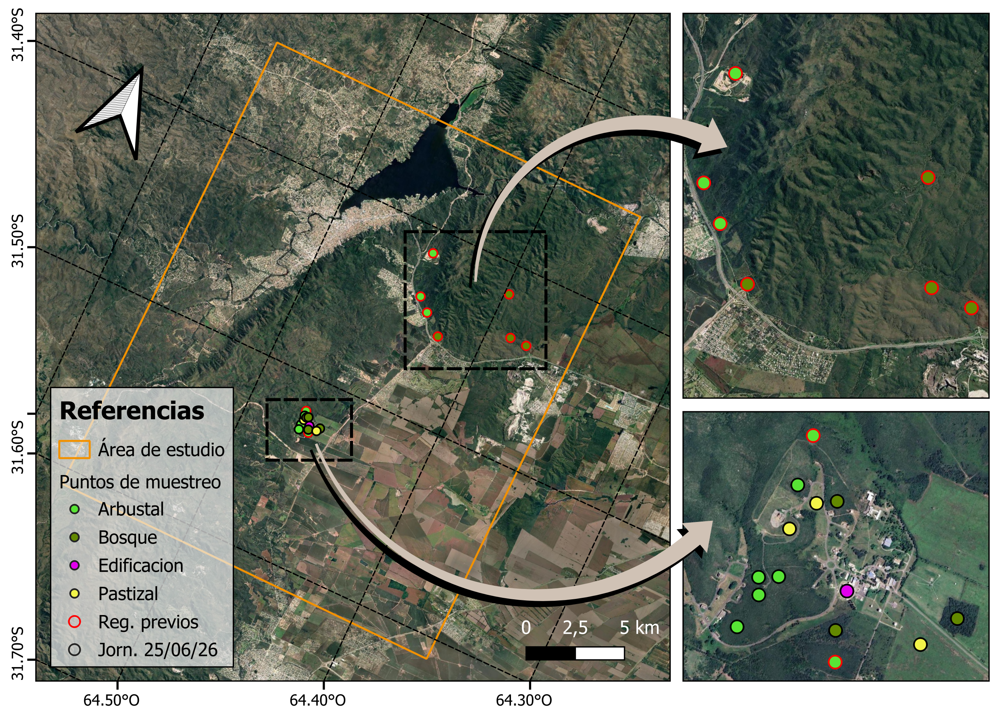

# 1. Objetivo

El objetivo principal consistió en adquirir nociones básicas vinculadas a la elaboración de mapas de coberturas y uso del suelo a partir de clasificaciones supervisadas de imágenes satelitales.  

Este trabajo estuvo organizado en tres etapas. La primera abordó la recolección de  datos de referencia para entrenar y validar la clasificación, y la selección y preparación de las imágenes satelitales sobre las cuales se realizó la clasificación. La segunda consistió en la ejecución de la clasificación propiamente dicha, mientras que en la tercera etapa se hace una validación o verificación de la  exactitud del producto generado. 

# 2. Metodología

## 2.1. Área de estudio

El área sobre la cual se ha trabajado pertenece a las denominadas Sierras Chicas (SSCC) de la Provincia de Córdoba (Argentina). Las sierras ocupan una superficie de 810.000 ha y comprenden un gradiente de elevaciones entre 500 y 1950 m snm. El clima es templado semiárido, con un régimen de precipitaciones monzónico. El promedio anual de precipitaciones es de 850 mm, concentradas principalmente en el semestre más cálido, entre Septiembre y Marzo, dando lugar a inviernos secos y veranos húmedos. La temperatura media anual de 17,3 °C. La vegetación se clasifica como perteneciente al distrito Chaqueño Serrano, que es la porción más austral del bosque de estación seca conocido como Gran Chaco Americano (Cabrera, 1976). 

La vegetación en las SSCC consiste en un mosaico de bosques, arbustales y pastizales distribuidas a lo largo de todo el gradiente altitudinal (Cabido et al., 2018; Cingolani et al., 2022; Giorgis et al., 2011). Los bosques están dominados por *Lithraea molleoides* (nombre común: Molle) y *Zanthoxylum coco* (nombre común: Coco), pudiendo presentar un estrato arbóreo altamente desarrollado, con coberturas superiores al 80 % y alturas entre 5 y 9 m. Los arbustales están dominados por *Vachellia caven* (nombre común: Espinillo) y presentan una cobertura del estrato arbustivo entre 25 y 65 %, con alturas que oscilan entre 2 y 4 m.

El área sobre la cual se ejecutó la clasificación de coberturas y uso de suelo, abarca un sector de las Sierras Chicas de 59.700 ha, cuyos límites son... . La misma incluye áreas urbanizadas y de interés, tales como Carlos Paz y alrededores, Malagueño, y el propio CETT ubicado en Falda del Cañete **(Figura X)**. 

$$$$$$$$$$$$$$$
**Figura X.**---

## 2.2. Recolección de datos de campo

El día 25 de junio del 2026 se realizó una recorrida por el Centro Espacial Teófilo Tabanera [CETT] (Falda del Cañete, Córdoba) con el fin de realizar una recolección de datos de referencia sobre el tipo de cobertura y vegetación sobre distintos puntos previamente definidos dentro del área del CETT. En total se referenciaron 12 puntos según 4 categorías: arbustal, bosque, pastizal y edificación/urbano.

## 2.3. Procesamiento de datos e imágenes satelitales

### 2.3.1. Datos de campo

A los datos de campo recolectados se les agregaron datos de puntos a los que previamente se les había asignado un tipo de cobertura y/o uso de suelo. De esta forma se contó con un total de 21 registros dentro del CETT para las clasificaciones posteriores, que se volcaron en una capa vectorial. Las operaciones de geoprocesamiento necesarias para este paso se realizaron empleando el software QGIS.

### 2.3.2. Imágenes satelitales

Para la clasificación se han empleado dos escenas de Sentinel 2 (S8) con nivel de procesamiento 2, incluyendo las bandas 2 a 12. Una de ellas fue obtenida el día 6 de enero del año 2026, correspondiente a la época húmeda, mientras que la segunda fue obtenida el día 26 de mayo del mismo año, y se corresponde a la época seca. **(Figura X)**. Esta contenían el área de estudio previamente definida (ver ítem 2.1), por lo que posteriormente fueron clippeadas según los límites de la misma. 

A partir de estas imágenes se han generado 3 índices espectrales derivados: el Índice de Vegetación de Diferencia Normalizada (NDVI), el Índice Diferencial de Agua Normalizado (NDWI) y el Índice Urbano (UI) a partir del cómputo del algebra de bandas siguiendo las **Ecuaciones X, X, y X**, respectivamente.

$NDVI = \frac{NIR-Red}{NIR+Red}$ **Ecuación X**

$NDWI = \frac{Green-NIR}{Green-NIR}$ **Ecuación X**

$UI = \frac{SWIR2-RedEdge4}{SWIR2+RedEdge4}$ **Ecuación X**

Adicionalmente se empleó el producto de modelo digital de elevación (MDE) con resolución de 30 m de Shuttle Radar Topography Mission (SRTM). Finalmente, se creó un cubo de datos incluyendo las bandas 2-12 para las escenas de S2, los indices derivados y el MDE, a partir de su apilado. De esta forma, quedaron listos los datos clasificación y elaboración del mapa de coberturas y uso de suelo en el siguiente paso. 

La obtención y procesamiento de las imágenes de S2, así como la obtención de los indices espectrales derivados y el modelo de elevación, como la ejecución de geoprocesamiento, se han realizado a través del [editor de código de Google Earth Engine](https://code.earthengine.google.com/). De esta forma, todo el procesamiento se ejecutó en la nube, prescindiendo de recursos computacionales propios. Por otro lado, esto facilitó realizar tanto el procesamiento de los datos, así como la clasificación, en un flujo de trabajo unificado. 

## 2.4. Clasificación y evaluación de los resultados

### 2.4.1. Modelo empleado

La ejecución de la clasificación para la posterior elaboración de los mapas de coberturas en el área de estudio, se realizó empleando el modelo de clasificación *Random Forest* (RF). Este tipo de modelo de machine learning se caracteriza por construir múltiples árboles de decisión durante el entrenamiento, en lugar de depender de un solo árbol. Luego combina las predicciones de todos ellos, mediante votación o promediando, lo que da un resultado más estable. 

Este paso, al igual que en el ítem 2.3, se ha realizado en la nube a través de la infraestructura de GEE, y se ha empleado el clasificador *SMILE Random Forest*, el cual arroja como resultado la clase más votada entre todos los árboles. Su configuración incluye una serie de parámetros tales como la cantidad de árboles, la cantidad de variables por división, y la fracción de los datos a usar durante el entranamiento de cada arbol, entre otros. 

### 2.4.2. Datos de entrenamiento

El entrenamiento del modelo se realizó a partir de muestras extraídas sobre las bandas de reflectancia 2-12 de las dos escenas de S2 (época seca y época húmeda), los índices derivados para cada escena, y el MDE. Las muestras, por un lado, se obtuvieron a partir de polígonos alrededor de los puntos donde habían datos de campo. A estos se le sumaron polígonos previamente cargadas y clasificados, junto a nuevos polígonos de generados a partir de la inspección visual de las imágenes de S8. A cada uno de ellos se le asignó alguna de las siguientes categorías según conocimientos previos del área y de la jornada de recolección de datos de campo: bosque, arbustal, pastizal, roca, agua, cultivo y urbanización. 

El total de muestras, posteriormente, se dividió en un subconjunto de entrenamiento y en otro de testeo. La asignación fue aleatoria, y la proporción se definió en 70% de los datos para el entrenamiento, y el 30% restante para el testeo del modelo y el cómputo de los parámetros de evaluación de su performance.

### 2.4.3. Evaluación del modelo y pruebas

Los resultados de las clasificaciones ejecutadas fueron evaluadas a partir de su matriz de confusión, la exactitud del usuario (EU), la exactitud del productor (EP) y la exactitud global (EG). Bajo estos criterios, se realizaron dos clasificaciones en total, donde en cada una se han modificado los polígonos de muestreo (incluido y/o eliminado) y los parámetros del modelo. Las modificaciones realizadas tuvieron como objetivo la búsqueda de la mejora en los resultados de la clasificación. 

# 3. Resultados

## 3.1. Datos de campo

Tal como se ha mencionado en el ítem 2.3.1, a los datos recolectados la jornada del 25 de junio del 2025 en el CETT, se le sumaron los de registros anteriores. En total sumaron 21 puntos sobre los cuales se contaba con información de campo sobre la cobertura y/o uso del suelo dentro del precio del centro espacial. 

## 3.2. Primer modelo

## 3.3. Segundo modelo

## 2.1. Área de estudio

El área sobre

| Modelo | b | m | p-valor (m) | $R^{2}$ | Observación |
|:-------|------------:|--:|--:|--:|--------:|
| *M1* | 3.54 | 0.38 | 0.20 | 0.30 | Incluye los 7 ptos. de muestreo |
| *M2* | 3.82 | 0.33 | 0.17 | 0.41 | Excluye el sitio *SAT 1* |

**Tabla X**. ---

# Referencias

Cabido, M., Zeballos, S. R., Zak, M., Carranza, M. L., Giorgis, M. A., Cantero, J. J., & Acosta, A. T. R. (2018). Native woody vegetation in central Argentina: Classification of Chaco and Espinal  forests. Applied Vegetation Science, 21(2), 298–311.  
Cabrera, A. L. (1976). Regiones fitogeográficas argentinas. Enciclopedia Argentina de Agricultura  y Jardinería. Tomo II. Acme. 
Cingolani, A. M., Giorgis, M. A., Hoyos, L. E., & Cabido, M. (2022). La vegetación de las montañas de Córdoba (Argentina) a comienzos del siglo XXI: un mapa base para el ordenamiento territorial. Boletín de la Sociedad Argentina de Botánica, 57(1), 65–100. 
Giorgis, M. A., Cingolani, A. M., Chiarini, F., Chiapella, J., Barboza, G., Ariza Espinar, L., Morero,  R., Gurvich, D. E., Tecco, P. A., Subils, R., & Cabido, M. (2011). Composición florística del Bosque Chaqueño Serrano de la provincia de Córdoba, Argentina. Kurtziana, 36(1), 9–43.  