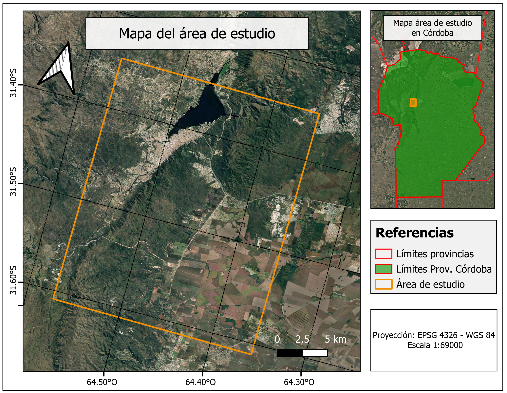
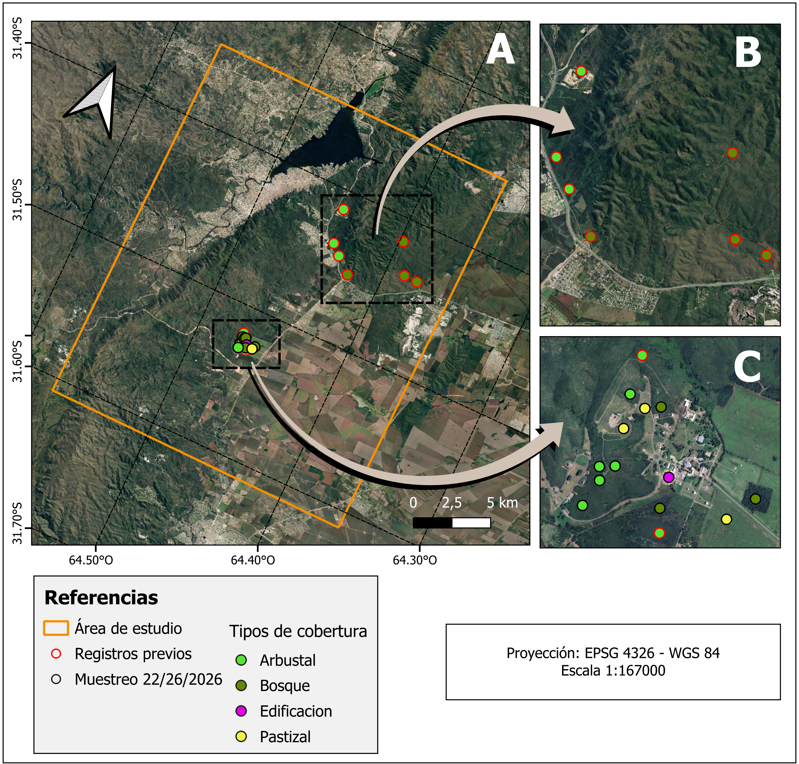
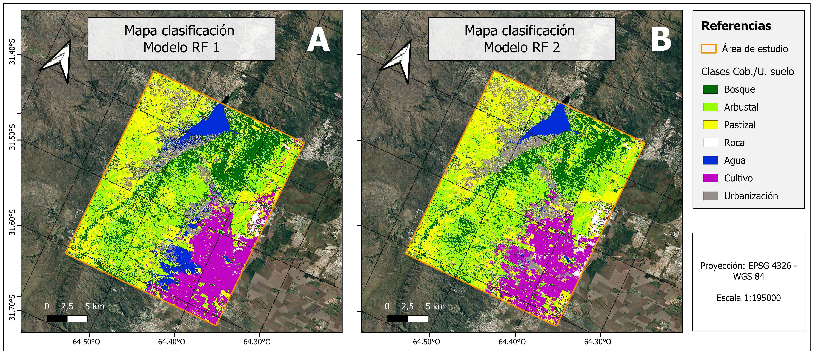

\Large

**Trabajo práctico N°4. Clasificación de imágenes satelitales para la elaboración de un mapa de cubiertas y uso del suelo**

**Matería:** Teledetección Ambiental (Maestría en Aplicaciones de Información Espacial, I. Gulich)

**Docentes:** Dra. Fernanda García, Dra. Anabella Ferral, Dr. Juan Argarañaz

**Alumno:** Franco David Barrionuevo

**Año:** 2026

\normalsize

---
# 1. Objetivo

El objetivo principal consistió en adquirir nociones básicas vinculadas a la elaboración de mapas de coberturas y uso del suelo a partir de clasificaciones supervisadas de imágenes satelitales.  

Este trabajo estuvo organizado en tres etapas. La primera abordó la recolección de  datos de referencia para entrenar y validar la clasificación, y la selección y preparación de las imágenes satelitales sobre las cuales se realizó la clasificación. La segunda consistió en la ejecución de la clasificación propiamente dicha, mientras que en la tercera etapa se hace una validación o verificación de la  exactitud del producto generado. 

# 2. Metodología

## 2.1. Área de estudio

El área sobre la cual se ha trabajado pertenece a las denominadas Sierras Chicas (SSCC) de la Provincia de Córdoba (Argentina). Las sierras ocupan una superficie de 810.000 ha y comprenden un gradiente de elevaciones entre 500 y 1950 m snm. El clima es templado semiárido, con un régimen de precipitaciones monzónico. El promedio anual de precipitaciones es de 850 mm, concentradas principalmente en el semestre más cálido, entre Septiembre y Marzo, dando lugar a inviernos secos y veranos húmedos. La temperatura media anual de 17,3 °C. La vegetación se clasifica como perteneciente al distrito Chaqueño Serrano, que es la porción más austral del bosque de estación seca conocido como Gran Chaco Americano (Cabrera, 1976). 

La vegetación en las SSCC consiste en un mosaico de bosques, arbustales y pastizales distribuidas a lo largo de todo el gradiente altitudinal (Cabido et al., 2018; Cingolani et al., 2022; Giorgis et al., 2011). Los bosques están dominados por *Lithraea molleoides* (nombre común: Molle) y *Zanthoxylum coco* (nombre común: Coco), pudiendo presentar un estrato arbóreo altamente desarrollado, con coberturas superiores al 80 % y alturas entre 5 y 9 m. Los arbustales están dominados por *Vachellia caven* (nombre común: Espinillo) y presentan una cobertura del estrato arbustivo entre 25 y 65 %, con alturas que oscilan entre 2 y 4 m.

El área sobre la cual se ejecutó la clasificación de coberturas y uso de suelo, abarca un sector de las Sierras Chicas de 59.700 ha. La misma incluye áreas urbanizadas y de interés, tales como Carlos Paz y alrededores, Malagueño, y el Centro Espacial Teófilo Tabanera ubicado en Falda del Cañete (**Figura 1**). 

{ width=55% }

## 2.2. Recolección de datos de campo

El día 25 de junio del 2026 se realizó una recorrida por el CETT con el fin de realizar una recolección de datos de referencia sobre el tipo de cobertura y vegetación sobre distintos puntos previamente definidos dentro del área del CETT. En total se referenciaron 12 puntos según 4 categorías: arbustal, bosque, pastizal y edificación/urbano.

## 2.3. Procesamiento de datos e imágenes satelitales

### 2.3.1. Datos de campo

A los datos de campo recolectados se les agregaron datos de puntos recolectados en campañas anteriores y que ya tenían asignado un tipo de cobertura y/o uso de suelo. De esta forma, se contó con un total de 21 registros dentro del CETT para las clasificaciones posteriores, que se volcaron en una capa vectorial. Las operaciones de geoprocesamiento necesarias para este paso se realizaron empleando el software QGIS.

### 2.3.2. Imágenes satelitales

Para la clasificación se utilizaron dos escenas del satélite Sentinel-2 (S2) con nivel de procesamiento 2A, incluyendo las bandas 2 a 12. La primera fue adquirida el 6 de enero de 2026, correspondiente a la época húmeda, mientras que la segunda fue obtenida el 26 de mayo del mismo año, representativa de la época seca. Ambas escenas cubrían el área de estudio previamente definida (ver ítem 2.1), por lo que posteriormente fueron recortadas utilizando sus límites. A partir de estas imágenes se calcularon tres índices espectrales derivados: el Índice de Vegetación de Diferencia Normalizada (NDVI), el Índice Diferencial de Agua Normalizado (NDWI) y el Índice Urbano (UI), mediante álgebra de bandas según las **Ecuaciones 1, 2 y 3**, respectivamente.

\begin{equation}
NDVI = \frac{NIR-Red}{NIR+Red}
\end{equation}

\begin{equation}
NDWI = \frac{Green-NIR}{Green-NIR}
\end{equation}

\begin{equation}
UI = \frac{SWIR2-RedEdge4}{SWIR2+RedEdge4}
\end{equation}

Adicionalmente, se empleó el Modelo Digital de Elevación (MDE) de la misión Shuttle Radar Topography Mission (SRTM), con una resolución espacial de 30 m. Finalmente, se generó un cubo de datos mediante el apilado de las bandas 2 a 12 de ambas escenas de Sentinel-2, los índices espectrales derivados y el MDE. Este conjunto de datos constituyó la base para la clasificación y la elaboración del mapa de coberturas y usos del suelo.

La adquisición y el procesamiento de las imágenes de Sentinel-2, el cálculo de los índices espectrales, la incorporación del modelo de elevación y las operaciones de geoprocesamiento se realizaron mediante el [editor de código de Google Earth Engine](https://code.earthengine.google.com/). De esta manera, todo el flujo de trabajo se ejecutó en la nube, prescindiendo del uso de recursos computacionales locales y permitiendo integrar el procesamiento de los datos y la clasificación en un único entorno de trabajo.

## 2.4. Clasificación y evaluación de los resultados

### 2.4.1. Modelo empleado

La clasificación para la elaboración de los mapas de coberturas del área de estudio se realizó mediante el algoritmo de *Random Forest* (RF). Este modelo de *machine learning* se caracteriza por construir múltiples árboles de decisión durante el entrenamiento, en lugar de uno solo. Posteriormente, combina las predicciones de todos ellos mediante un esquema de votación, asignando a cada píxel la clase más votada. Este enfoque reduce el sobreajuste y proporciona resultados más robustos y estables.

Al igual que las etapas descritas en el ítem 2.3, la clasificación se ejecutó íntegramente en la nube utilizando la infraestructura de Google Earth Engine (GEE), empleando el clasificador *SMILE Random Forest*. Su configuración contempla diversos parámetros, entre ellos la cantidad de árboles de decisión, el número de variables consideradas en cada división y la fracción de muestras utilizada para entrenar cada árbol, entre otros.

### 2.4.2. Datos de entrenamiento

El entrenamiento del modelo se realizó a partir de muestras extraídas sobre las bandas de reflectancia 2 a 12 de las dos escenas de Sentinel-2 (época húmeda y época seca), los índices espectrales derivados de cada una de ellas y el MDE. Las muestras se obtuvieron, por un lado, a partir de polígonos delineados alrededor de los puntos donde se disponía de registros de campo. A estas se incorporaron polígonos previamente generados y clasificados, así como nuevos polígonos definidos mediante la inspección visual de las imágenes de Sentinel-2. A cada polígono se le asignó una de las siguientes siete (7) clases, según el conocimiento previo del área de estudio y la información recopilada durante la campaña de campo: bosque, arbustal, pastizal, roca, agua, cultivo y urbanización.

El conjunto total de muestras se dividió posteriormente en dos subconjuntos: entrenamiento y testeo. La asignación se realizó de forma aleatoria, destinando el 70 % de las muestras al entrenamiento del modelo y el 30 % restante a su validación mediante el cálculo de los parámetros utilizados para evaluar su desempeño.

### 2.4.3. Evaluación del modelo y pruebas

Los resultados de las clasificaciones se evaluaron mediante la matriz de confusión y los indicadores de exactitud del usuario (EU), exactitud del productor (EP) y exactitud global (EG). Con base en estos criterios, se realizaron dos clasificaciones, modificando en cada iteración tanto los polígonos de entrenamiento (incorporando, eliminando o ajustando muestras) como los parámetros del modelo. Estas modificaciones tuvieron como objetivo mejorar el desempeño de la clasificación y obtener resultados más precisos.

# 3. Resultados

## 3.1. Datos de campo

Tal como se mencionó en el ítem 2.3.1, a los datos recolectados durante la jornada de campo del 25 de junio de 2025 en el CETT se incorporaron registros obtenidos previamente. En total, se obtuvieron de 21 puntos con información de campo sobre la cobertura y/o el uso del suelo, distribuidos entre la ciudad de Malagueño y Villa Carlos Paz (**Figura 2.B**), así como dentro del predio del Centro Espacial (**Figura 2.C**).

Cada uno de los puntos fue asociado a las clases definidas en el ítem 2.4.2 de acuerdo con la cobertura identificada en campo. De esta forma, 10 puntos fueron clasificados como arbustal, 7 como bosque, 3 como pastizal y 1 como urbanización.

{ width=55% }

## 3.2. Ajuste y evaluación del modelo de clasificación

Con el objetivo de obtener un modelo capaz de clasificar con la mayor precisión las coberturas del área de estudio, se realizaron dos instancias de entrenamiento del algoritmo *Random Forest*. La primera se utilizó como línea de base para evaluar el desempeño inicial del modelo, mientras que en la segunda se incorporaron modificaciones tanto en los datos de entrenamiento como en los parámetros del clasificador, definidas a partir del análisis de los resultados obtenidos en la primera ejecución.

En ambos casos se emplearon los mismos datos de campo relevados (21 polígonos; ver ítem 3.1), complementados con polígonos digitalizados mediante la inspección visual de las imágenes S2 correspondientes a las épocas seca y húmeda. El **Cuadro 1** resume la cantidad de polígonos utilizados por clase en cada una de las clasificaciones.

| Clase | **Modelo 1** | **Modelo 2** |
|:-------|-------------:|-------------:|
| Bosque | 34 | 38 |
| Arbustal | 34 | 39 |
| Pastizal | 34 | 36 |
| Roca | 25 | 25 |
| Agua | 19 | 22 |
| Cultivo | 18 | 14 |
| Urbanización | 17 | 19 |
| **Total de polígonos** | **181** | **193** |
| **Total de píxeles** | **3307** | **2567** |
Table: Comparación de los datos de entrenamiento empleados para el entrenamiento durante las dos instancias.

Además de modificar el conjunto de entrenamiento, también se ajustaron los parámetros del clasificador. En particular, en el segundo modelo se incrementó la cantidad de árboles, se definió explícitamente el número de variables consideradas en cada ramificación, se aumentó el mínimo de elementos por nodo, se redujo la fracción de datos utilizada para entrenar cada árbol y se fijó la semilla del algoritmo para garantizar la reproducibilidad de los resultados. El **Cuadro 2** resume la configuración empleada en cada caso.

| Parámetro | **Modelo 1** | **Modelo 2** |
|:-----------------------------|:-------------:|:-------------:|
| Cantidad de árboles | 100 | 120 |
| Variables por ramificación | *Default* | 7 |
| Mínimo de elementos por ramificación | 1 | 3 |
| Fracción de datos por árbol | 1 | 0.8 |
| Semilla | *Default* (Aleatoria) | 42 |
Table: Comparación de los valores definidos para los parámetros de los modelos entrenados durante las dos instancias.

Los resultados de ambas clasificaciones se muestran en la **Figura 3**. El primer modelo alcanzó una precisión global cercana al 85%, mientras que el segundo obtuvo una precisión superior al 94%, lo que representa una mejora aproximada del 11%.

En el primer modelo, la clase arbustal presentó la menor precisión del productor (61%), indicando que una proporción importante de los píxeles de referencia pertenecientes a esta clase fue clasificada principalmente como bosque. Asimismo, la clase agua registró la menor precisión del usuario (56%), debido a que una fracción considerable de los píxeles clasificados como agua correspondía en realidad a otras clases, principalmente urbanización.

Luego de incorporar las modificaciones propuestas, el segundo modelo mostró una mejora general en todas las métricas de evaluación. La clase arbustal continuó presentando la menor precisión del productor (84%), aunque con un incremento significativo respecto del primer modelo. Los píxeles de referencia que no fueron correctamente clasificados se asignaron principalmente a las clases bosque y pastizal. Por su parte, las clases pastizal y roca registraron la menor precisión del usuario (83% y 86%, respectivamente). En el primer caso, una fracción de los píxeles clasificados como pastizal correspondía en realidad a arbustal, mientras que en el segundo algunos píxeles clasificados como roca pertenecían a la clase cultivo.

{ width=75% }

La comparación visual confirma la mejora reflejada por los indicadores de evaluación. En el primer modelo se observan errores evidentes, como la clasificación de áreas urbanas o de cultivo como agua, posiblemente asociados al desbalance entre clases y a la configuración inicial del clasificador. En el segundo modelo estos errores se logran reducir, aunque aún persisten algunas confusiones entre las clases cultivo, urbanización y roca.

Bajo el resultado obtenido con el segundo modelo, se observa que el área de estudio presenta un predominio de las clases pastizal y arbustal, que ocupan aproximadamente un 25% de la superficie total cada una. Si bien el ajuste realizado permitió mejorar significativamente el desempeño del clasificador, el trabajo futuro deberá centrarse en incorporar nuevos datos de entrenamiento representativos y explorar configuraciones alternativas del algoritmo con el fin de reducir las confusiones aun persistentes entre algunas clases.

# 4. Referencias

\begin{small}

Cabido, M., Zeballos, S. R., Zak, M., Carranza, M. L., Giorgis, M. A., Cantero, J. J., \& Acosta, A. T. R. (2018). Native
woody vegetation in central Argentina: Classification of Chaco and Espinal  forests. Applied Vegetation Science, 21(2), 298–311.  

Cabrera, A. L. (1976). Regiones fitogeográficas argentinas. Enciclopedia Argentina de Agricultura  y Jardinería. Tomo II. Acme. 

Cingolani, A. M., Giorgis, M. A., Hoyos, L. E., \& Cabido, M. (2022). La vegetación de las montañas de Córdoba (Argentina) a comienzos del siglo XXI: un mapa base para el ordenamiento territorial. Boletín de la Sociedad Argentina de Botánica, 57(1), 65–100. 

Giorgis, M. A., Cingolani, A. M., Chiarini, F., Chiapella, J., Barboza, G., Ariza Espinar, L., Morero,  R., Gurvich, D. E., Tecco, P. A., Subils, R., \& Cabido, M. (2011). Composición florística del Bosque Chaqueño Serrano de la provincia de Córdoba, Argentina. Kurtziana, 36(1), 9–43.

\end{small}

# Anexos

| Clase (Referencia) | Bosque | Arbustal | Pastizal | Roca | Agua | Cultivo | Urbanización | EU | PU |
|--------------------|--------:|---------:|----------:|-----:|------:|---------:|--------------:|---:|---:|
| **Bosque**         | 133 | 40 | 0 | 0 | 0 | 0 | 0 | 0.23 | 0.77 |
| **Arbustal**       | 27 | 86 | 0 | 0 | 0 | 0 | 0 | 0.24 | 0.76 |
| **Pastizal**       | 0 | 15 | 45 | 0 | 0 | 4 | 0 | 0.30 | 0.70 |
| **Roca**           | 0 | 0 | 0 | 122 | 0 | 0 | 15 | 0.11 | 0.89 |
| **Agua**           | 0 | 0 | 0 | 0 | 20 | 0 | 16 | 0.44 | 0.56 |
| **Cultivo**        | 0 | 0 | 0 | 2 | 0 | 78 | 0 | 0.03 | 0.98 |
| **Urbanización**   | 0 | 0 | 0 | 0 | 0 | 0 | 185 | 0.00 | 1.00 |
| **EP**             | 0.17 | 0.39 | 0.00 | 0.02 | 0.00 | 0.05 | 0.14 | **84.90** | |
| **PP**             | 0.83 | 0.61 | 1.00 | 0.98 | 1.00 | 0.95 | 0.86 | | |
Table: Matriz de confusión para modelo Random Forest 1 entrenado

| Clase (Referencia) | Bosque | Arbustal | Pastizal | Roca | Agua | Cultivo | Urbanización | EU | PU |
|--------------------|--------:|---------:|----------:|-----:|------:|---------:|--------------:|---:|---:|
| **Bosque**         | 148 | 16 | 0 | 0 | 0 | 0 | 0 | 0.10 | 0.90 |
| **Arbustal**       | 9 | 152 | 0 | 0 | 0 | 0 | 0 | 0.06 | 0.94 |
| **Pastizal**       | 0 | 12 | 59 | 0 | 0 | 0 | 0 | 0.17 | 0.83 |
| **Roca**           | 0 | 0 | 0 | 81 | 0 | 13 | 0 | 0.14 | 0.86 |
| **Agua**           | 0 | 0 | 0 | 0 | 87 | 3 | 3 | 0.06 | 0.94 |
| **Cultivo**        | 0 | 0 | 0 | 0 | 0 | 356 | 0 | 0.00 | 1.00 |
| **Urbanización**   | 0 | 0 | 0 | 0 | 0 | 1 | 130 | 0.01 | 0.99 |
| **EP**             | 0.06 | 0.16 | 0.00 | 0.00 | 0.00 | 0.05 | 0.02 | **94.67** | |
| **PP**             | 0.94 | 0.84 | 1.00 | 1.00 | 1.00 | 0.95 | 0.98 | | |
Table: Matriz de confusión para modelo Random Forest 2 entrenado

