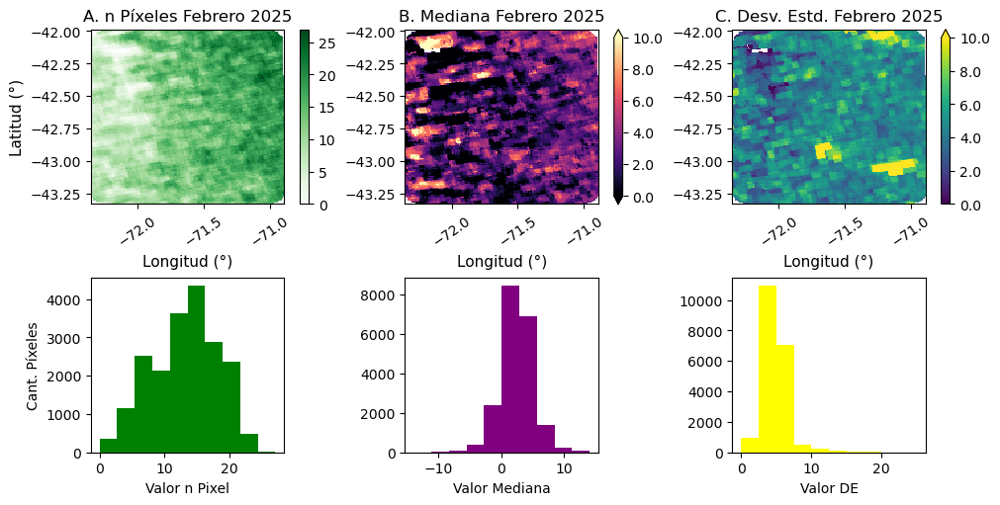
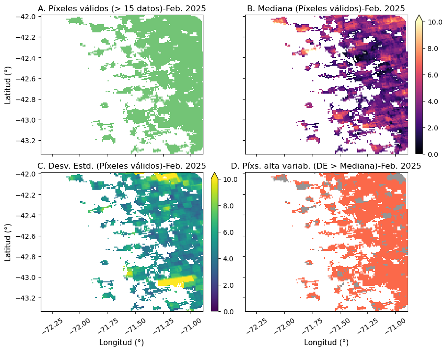
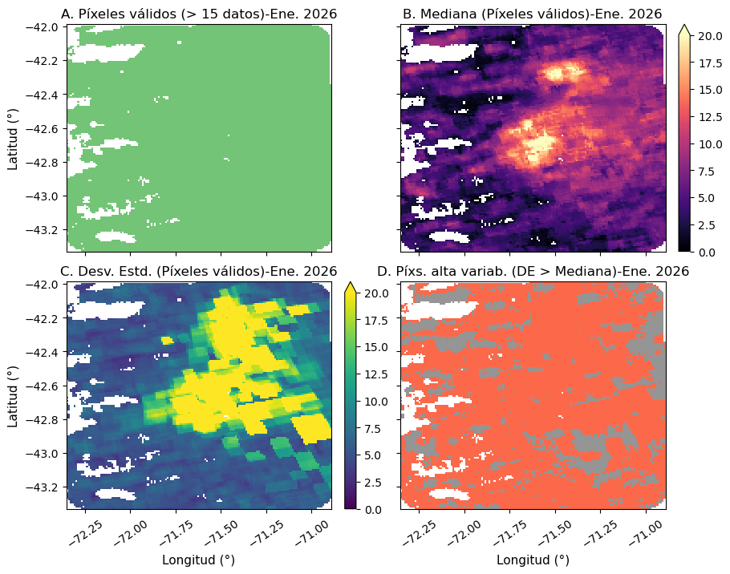

# 1. Objetivo

--

# 2. Metodología

## 2.1. Área de estudio

Con el fin de estudiar el efecto de los [incendios ocurridos en la provincia de Chubut (Argentina) durante enero de 2026](https://www.infobae.com/salud/ciencia/2026/01/30/la-patagonia-argentina-sufre-el-incendio-mas-intenso-en-dos-decadas-segun-el-sistema-satelital-de-la-union-europea/) sobre las emisiones de $NO_{2}$, se definió un polígono delimitado entre **72.35°O (-72.35°) y 70.89°O (-70.89°) de longitud**, y **43.36°S (-43.36°) y 41.95°S (-41.95°) de latitud** (ver Figura 1). De esta forma, se incluyeron las áreas del Parque Nacional Los Alerces y las localidades de El Hoyo y Epuyén, que fueron las zonas más afectadas por este evento.

La definición del polígono se realizó a partir del análisis realizado a través de la plataforma [NASA-FIRMS](https://firms.modaps.eosdis.nasa.gov/), mediante la cual se analizó la distribución espacial de las áreas quemadas, así como las fechas de ocurrencia de los incendios detectados por los sensores **MODIS** y **VIIRS**.

{ width=500px }

## 2.2. Fuentes de datos

### 2.3.1. Datos producto $NO_{2}$

Para estudiar la afectación de la calidad del aire por las emisiones de $NO_{2}$ producidas por los incendios ocurridos en la Patagonia argentina, dentro del área de estudio definida (ver ítem 2.1), se utilizó el producto *offline* de nivel 2 de $NO_{2}$ obtenido a partir del sensor TROPOMI a bordo del satélite Sentinel-5P. Este producto proporciona la abundancia troposférica de este contaminante en la columna vertical, expresada en unidades de $mol/m^{2}$.

El acceso a los datos, así como su procesamiento, se realizaron mediante el [editor de código de Google Earth Engine (GEE)](https://code.earthengine.google.com/). De esta forma, todas las tareas se ejecutaron en un entorno de computación en la nube, prescindiendo del uso de recursos computacionales locales.

Los datos de abundancia troposférica de $NO_{2}$ se adquirieron para dos períodos. El primero correspondió a un mes con ausencia o escasa ocurrencia de incendios, mientras que el segundo abarcó enero de 2026, período durante el cual se registraron los incendios objeto de este estudio. Dentro del entorno de GEE se obtuvieron todas las escenas disponibles para cada período y, mediante álgebra de bandas, se generaron composiciones temporales de la cantidad de píxeles con datos válidos (es decir, libres de nubes), así como de la suma, la mediana y el desvío estándar de la abundancia troposférica de $NO_{2}$ calculada píxel a píxel. 

### 2.3.2. Datos complementarios

Desde la plataforma NASA-FIRMS se descargaron los datos de focos de calor detectados por el sensor MODIS correspondientes a los meses de febrero de 2025 y enero de 2026. Estos datos proporcionan información sobre la ocurrencia y la distribución espacial de los incendios dentro del área de estudio. Su incorporación aporta evidencia que permite interpretar las diferencias observadas entre los períodos seleccionados para el análisis.

## 2.3. Análisis datos de $NO_{2}$

Los análisis implementados fueron realizado sobre las composiciones temporales de cantidad de píxeles con datos, y la mediana y el desvío estandar de la abundancia de $NO_{2}$ píxel a píxel para cada periodo. A partir de estas composiciones se llevó a cabo un primer análisis orientado a identificar las zonas con una cantidad suficiente de datos por píxel. Considerando que, durante el lapso de un mes, deberían adquirirse aproximadamente 30 escenas, se estableció un umbral mínimo de 15 datos por píxel. Todos aquellos píxeles que no cumplieron con este criterio fueron descartados.

Una vez identificadas las zonas del área de estudio que cumplían con el umbral mínimo de datos, se continuó con el análisis de la distribución espacial de la mediana y el desvío estándar de la abundancia de $NO_{2}$. Adicionalmente, se evaluó la relación entre ambos parámetros para cada período. Esta relación se utilizó como un indicador para determinar si la variabilidad observada en los registros de $NO_{2}$ respondía a una condición persistente ($D.\ \text{estándar} < \text{Mediana}$) o a la ocurrencia de eventos puntuales ($D.\ \text{estándar} > \text{Mediana}$) que afectaban la abundancia de este contaminente dentro del área de estudio.

Finalmente, se evaluaron visualmente las diferencias en la abundancia de $NO_{2}$ entre ambos períodos. Para ello, se emplearon gráficos estadísticos que resumen la distribución de los datos.

# 3. Resultaods

## 2.1. Periodos de análisis

Los periodos de análisis elegidos fueron febrero del año 2025 y enero del año 2026. Esta elección surge del análisis las áreas quemadas realizado a través de la plataforma de NASA-FIRMS. Tal como se puede observar en la **Figura X**, la cantidad de focos de calor asociados a incendios obtenidos a partir de productos MODIS dentro del área de estudio fue mayor en el segundo (1530 focos de calor) caso comparado con febrero del 2025 (130 focos de calor). Esto se condice con lo registrado en relación a los incendios de importante magnitud ocurridos en dicha región durante 2026. 

## 2.2. Febrero 2025

Tal como se observa en la **Figura X** los resultados de las composiciones temporales para el periodo de febrero del año 2025 arrojó que alrededor de la mitad de los píxeles se encuentran por debajo del umbral de cantidad de píxeles mínimos. Estos se hallan principalmente en la zona al oeste del área de estudio, lo cual coincide con la ubicación por encima de la Cordillera de los Andes. Los datos de mediana computada muestran una baja dispersión, observándose valores en el rango entre los -10 y 10 $mol/m^{2}$. Los valores negativos no tienen sentido físico, y se corresponden con aquellos donde hubo interferencia por nubosidad. Por otro lado, los datos del desvío estándar muestran con valores en el rango entre los 0 y 10 $mol/m^{2}$.

El análisis de los datos, ya enmascarados aquellos píxeles con no cumplían con el umbral establecido, permitió obtener un panorama más representativo de lo que ocurrió durante el periodo de acuerdo a la **Figura X**. Aquí se observa que predomina una mediana entre los 2 y 4 $mol/m^{2}$, y algunas zonas con valores mayores al máximo registrado de 10 $mol/m^{2}$. Los valores de desvío muestran una predominancia entre los 4 y 6 $mol/m^{2}$. Se destacan dos manchones con variabilidad superior a los 10 $mol/m^{2}$. Al analizar la relación entre la mediana y el desvío, se observa que para la mayor parte del área estudiada se cumple que el $DE > Mediana$. De esta manera, a modo preliminar, es posible mencionar para febrero del año 2025 la abundancia de $NO_{2}$ mostró alta variabilidad.

## 2.3. Enero 2026

Como se visuaiza en la **Figura X**, los resultados de las composiciones temporales para el periodo de enero del 2026 muestran que la mayor proporción de los píxeles se encuentran por encima del umbral de cantidad de píxeles mínimos. De esta forma, la mayoría de los datos de la composición generada son útiles los análisis posteriores. Los datos de mediana computada muestran una mayor dispersión, y una un corrimiento a la derecha, observándose valores en el rango entre los -5 y 10 $mol/m^{2}$, alcanzándose máximos alrededor de los 20 $mol/m^{2}$. Al igual, que en el caso anterior, los valores negativos no tienen sentido físico, y se corresponden con aquellos donde hubo interferencia por nubosidad. Por otro lado, los datos del desvío estándar muestran valores en el rango entre los 0 y 20 $mol/m^{2}$, registrándose máximos de alrededor de los 200 $mol/m^{2}$.

Una vez enmascarados aquellos píxeles con no cumplían con el umbral establecido, tal como se observa en la **Figura X** su análisis arrojó que predominó una mediana entre los 5 y 10 $mol/m^{2}$, así como la ocurrencia de dos grandes núcleos con abundancias mayores a los 15 $mol/m^{2}$. Por su ubicación, que se verifica en la **Figura X**, estos se corresponden al aumento producido por la quema de biomasa en los incendios ocurridos durante dicho periodo. Los valores de desvío muestran una predominancia entre los 5 y 10 $mol/m^{2}$. Se observan tambien grandes extensiones con valores de desvio mayores a los 20 $mol/m^{2}, también relacionadas por su ubicación a los incendios ocurridos. Al analizar la relación entre la mediana y el desvío, se observa que para la mayor parte del área estudiada se cumple que el $DE > Mediana$. De esta forma, se observa la predominancia de una alta variabilidad en la abundancia de $NO_{2}$ producto de los incendios ocurridos que afectaron fuertemente la calidad del aire en la región por generación de este contaminante. 

## 2.4. Comparación entre periodos

La comparación de la mediana de la abundancia de $NO_{2}$ entre los dos periodos a través del gráfico de boxplot de la **Figura X**, muestra que existe una diferencia en el valor de la tendencia central computado dentro del área de estudio. Esta aproximadamente se duplicó durante los incendios de Enero del 2026. El rango intercuatílico es mucho más alto durante dicho periodo, lo que habla de una mayor heterogeneidad espacial. Finalmente, la existencia de numerosos outliers habla de la existencia de zonas con abundancias excepcionalmente altas de $NO_{2}$, las cuales podrían estar vinculadas a los propios focos de incendios.
