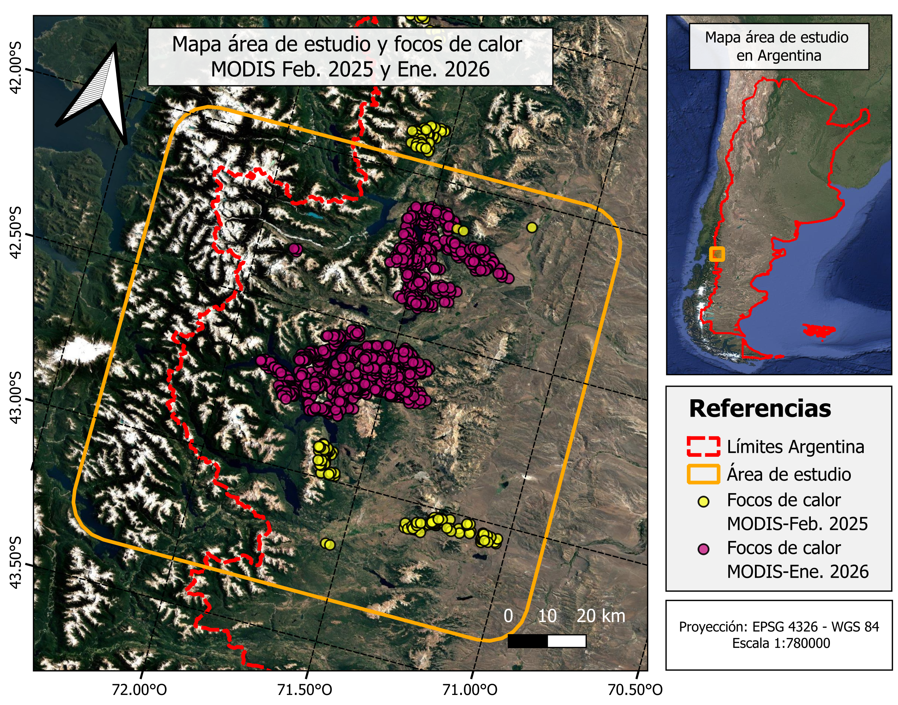
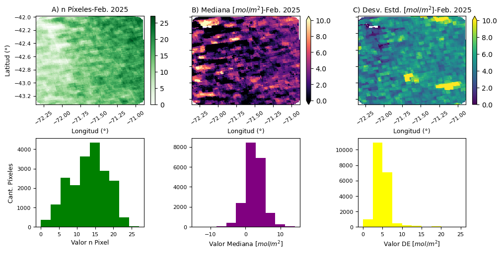
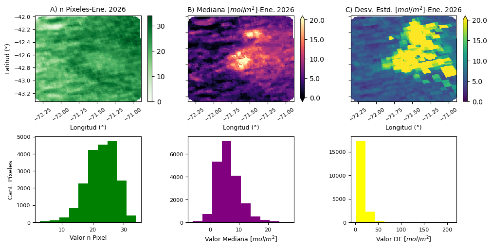
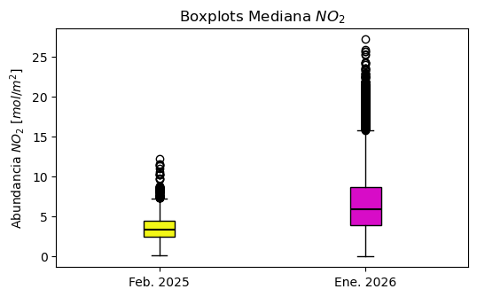

\Large

**Título:** Trabajo práctico N°5. Análisis de $NO_{2}$ troposférico con Google Earth Engine

**Materia:** Teledetección Ambiental (Maestría en Aplicaciones de Información Espacial, I. Gulich)

**Docentes:** Dra. Fernanda García, Dra. Anabella Ferral, Dr. Juan Argarañaz

**Alumno:** Franco David Barrionuevo

**Año:** 2026

\normalsize

---

# 1. Objetivo

 El $NO_{2}$ es un gas que se forma en el aire muy rápido, por oxidación del NO emitido durante la combustión de combustibles fósiles y biomasa, y se encuentra cerca de fuentes de tránsito, industriales e incendios. El presente trabajo tuvo como objetivo evaluar el cambio en la abundancia de este contaminante como consecuencia de los incendios forestales ocurridos en la Patagonia argentina durante enero del año 2026. Para ello, se emplearon datos satelitales correspondientes a dos períodos: uno coincidente con el evento de estudio y otro sin grandes incendios registrados en la misma estación, lo que permitió analizar las diferencias en la abundancia de $NO_{2}$ entre ambos escenarios.

# 2. Metodología

## 2.1. Área de estudio

Con el fin de estudiar el efecto de los [incendios ocurridos en la provincia de Chubut (Argentina) durante enero de 2026](https://www.infobae.com/salud/ciencia/2026/01/30/la-patagonia-argentina-sufre-el-incendio-mas-intenso-en-dos-decadas-segun-el-sistema-satelital-de-la-union-europea/) sobre las emisiones de $NO_{2}$, se definió un polígono delimitado entre **72.35°O (-72.35°) y 70.89°O (-70.89°) de longitud**, y **43.36°S (-43.36°) y 41.95°S (-41.95°) de latitud** (ver **Figura 1**). De esta forma, se incluyeron las áreas del Parque Nacional Los Alerces y las localidades de El Hoyo y Epuyén, que fueron las zonas más afectadas por este evento.

La definición del polígono se realizó a partir del análisis realizado a través de la plataforma [NASA-FIRMS](https://firms.modaps.eosdis.nasa.gov/), mediante la cual se analizó la distribución espacial de las áreas quemadas, así como las fechas de ocurrencia de los incendios detectados por los sensores MODIS y VIIRS.

{ width=55% }

## 2.2. Fuentes de datos

### 2.3.1. Datos producto $NO_{2}$

Para estudiar la afectación de la calidad del aire por las emisiones de $NO_{2}$ producidas por los incendios ocurridos en la Patagonia argentina, dentro del área de estudio definida (ver ítem 2.1), se utilizó el producto *offline* de nivel 2 de $NO_{2}$ obtenido a partir del sensor TROPOMI a bordo del satélite Sentinel-5P. Este producto proporciona la abundancia troposférica de este contaminante en la columna vertical, expresada en unidades de $mol/m^{2}$.

El acceso a los datos, así como su procesamiento, se realizaron mediante el [editor de código de Google Earth Engine (GEE)](https://code.earthengine.google.com/). De esta forma, todas las tareas se ejecutaron en un entorno de computación en la nube, prescindiendo del uso de recursos computacionales locales.

Los datos de abundancia troposférica de $NO_{2}$ se adquirieron para dos períodos en la misma estación del año. El primero se correspondió a un mes con ausencia o escasa ocurrencia de incendios, mientras que el segundo abarcó enero de 2026, período durante el cual se registraron los incendios objeto de este estudio. Dentro del entorno de GEE se obtuvieron todas las escenas disponibles para cada período y, mediante álgebra de bandas, se generaron composiciones temporales. De esta forma, se obtuvieron las composiciones correspondientes a la cantidad de píxeles con datos válidos (n Píxeles), es decir sin nubes, así como la mediana y el desvío estándar (DE) de la abundancia troposférica de $NO_{2}$ calculada píxel a píxel. 

### 2.3.2. Datos complementarios

Desde la plataforma NASA-FIRMS se descargaron los datos de focos de calor detectados por el sensor MODIS correspondientes a los meses de febrero de 2025 y enero de 2026. Estos datos proporcionan información sobre la ocurrencia y la distribución espacial de los incendios dentro del área de estudio. Su incorporación aporta evidencia que permite interpretar las diferencias observadas entre los períodos seleccionados para el análisis.

## 2.3. Análisis datos de $NO_{2}$

Los análisis implementados fueron realizado sobre las composiciones temporales de cantidad de píxeles con datos, y la mediana y el desvío estandar de la abundancia de $NO_{2}$ píxel a píxel para cada periodo. A partir de estas composiciones se llevó a cabo un primer análisis orientado a identificar las zonas con una cantidad suficiente de datos por píxel. Considerando que, durante el lapso de un mes, deberían adquirirse aproximadamente 30 escenas, se estableció un umbral mínimo de 15 datos por píxel. Todos aquellos píxeles que no cumplieron con este criterio fueron descartados.

Una vez identificadas las zonas del área de estudio que cumplían con el umbral mínimo de datos, se continuó con el análisis de la distribución espacial de la mediana y el desvío estándar de la abundancia de $NO_{2}$. Adicionalmente, se evaluó la relación entre ambos parámetros para cada período. Esta relación se utilizó como un indicador para determinar si la variabilidad observada en los registros de $NO_{2}$ respondía a una condición persistente ($DE < \text{Mediana}$) o a la ocurrencia de eventos puntuales ($DE > \text{Mediana}$) que afectaban la abundancia de este contaminente dentro del área de estudio.

Finalmente, se evaluaron visualmente las diferencias en la abundancia de $NO_{2}$ entre ambos períodos. Para ello, se emplearon gráficos estadísticos que resumen la distribución de los datos.

# 3. Resultados y discusión

## 3.1. Periodos de análisis

Los períodos de análisis seleccionados fueron febrero de 2025 y enero de 2026. Esta elección se basó en el análisis de las áreas quemadas realizado a partir de la plataforma NASA-FIRMS. Tal como se observa en la **Figura 1**, la cantidad de focos de calor asociados a incendios, obtenidos a partir de productos MODIS dentro del área de estudio, fue considerablemente mayor durante enero de 2026 (1530 focos de calor) que en febrero de 2025 (130 focos de calor). Este resultado es consistente con los incendios de gran magnitud registrados en la región durante 2026.

## 3.2. Febrero 2025

Tal como se observa en la **Figura 2**, los resultados de las composiciones temporales para el período de febrero de 2025 muestran que alrededor de la mitad de los píxeles se encuentran por debajo del umbral mínimo de cantidad de datos. Estos se localizan principalmente en el sector oeste del área de estudio, coincidiendo con la región ubicada sobre la Cordillera de los Andes. Los datos de la mediana muestran un rango reducido, con valores comprendidos entre -10 y 10 $mol/m^{2}$. Los valores negativos carecen de sentido físico y corresponden a píxeles afectados por interferencias asociadas a la presencia de nubosidad. Por otro lado, el desvío estándar presenta valores comprendidos entre 0 y 10 $mol/m^{2}$.

{ width=65% }

El análisis de los datos, una vez enmascarados los píxeles que no cumplían con el umbral definido, permitió obtener un panorama más representativo de las condiciones observadas durante el período (**Figura 3**). Se observa un predominio de valores de mediana entre 2 y 4 $mol/m^{2}$, con algunas zonas que superan el valor máximo de 10 $mol/m^{2}$. En cuanto al desvío estándar, predominan valores entre 4 y 6 $mol/m^{2}$, aunque se identifican dos sectores con una variabilidad superior a 10 $mol/m^{2}$. Al analizar la relación entre la mediana y el desvío estándar, se observa que en la mayor parte del área de estudio se cumple que $DE > \text{Mediana}$. De manera preliminar, este resultado sugiere que durante febrero de 2025 la abundancia de $NO_{2}$ presentó una elevada variabilidad temporal. Estudios posteriores podrán dilucidar si esto se debe a una cuestión estacional o fue una situación atípica para tal época. 

{ width=60% }

## 3.3. Enero 2026

Como se observa en la **Figura 4**, los resultados de las composiciones temporales para el período de enero de 2026 muestran que la mayor proporción de los píxeles se encuentra por encima del umbral mínimo de cantidad de datos. De esta forma, la mayor parte de la composición generada resulta apta para los análisis posteriores. Los valores de la mediana muestran una mayor dispersión y un corrimiento hacia valores más altos, observándose un rango comprendido entre -5 y 10 $mol/m^{2}$, con máximos cercanos a los 20 $mol/m^{2}$. Al igual que en el caso anterior, los valores negativos carecen de sentido físico y corresponden a píxeles afectados por interferencias asociadas a la presencia de nubes. Por otro lado, el desvío estándar presenta valores comprendidos entre 0 y 20 $mol/m^{2}$, registrándose máximos cercanos a los 200 $mol/m^{2}$.

{ width=65% }

Una vez enmascarados los píxeles que no cumplían con el umbral establecido, su análisis (**Figura 5**) mostró un predominio de valores de mediana entre 5 y 10 $mol/m^{2}$, así como la presencia de dos grandes núcleos con abundancias superiores a 15 $mol/m^{2}$. Por su ubicación, que puede verificarse en la **Figura 1**, estos núcleos se asocian al incremento de $NO_{2}$ producido por la quema de biomasa durante los incendios ocurridos en ese periodo. En cuanto al desvío estándar, predominan valores entre 5 y 10 $mol/m^{2}$, aunque también se observan extensas áreas con valores superiores a 20 $mol/m^{2}$, de igual forma asociadas por su localización a los incendios registrados. Al analizar la relación entre la mediana y el desvío estándar, se observa que en la mayor parte del área de estudio se cumple que $DE > \text{Mediana}$. En conjunto, estos resultados indican una elevada variabilidad temporal en la abundancia de $NO_{2}$, consistente con el impacto de los incendios sobre la calidad del aire debido al incremento de las emisiones de este contaminante.

{ width=60% }

## 3.4. Comparación entre periodos

La comparación de la mediana de la abundancia de $NO_{2}$ entre ambos períodos mediante el gráfico de caja (*boxplot*) de la **Figura 6** muestra una diferencia marcada en la tendencia central de los datos dentro del área de estudio. En particular, la mediana aproximadamente se duplicó durante los incendios de enero de 2026. Asimismo, el rango intercuartílico es mayor en este período, lo que indica una mayor heterogeneidad espacial en la abundancia de $NO_{2}$. Finalmente, la presencia de numerosos valores *outliers* evidencia la existencia de zonas con abundancias excepcionalmente elevadas de $NO_{2}$, las cuales podrían estar asociadas directamente a las emisiones producidas por los focos de incendio.

{ width=40% }

# 4. Fuentes

\begin{small}

NASA Fire Information for Resource Management System: \url{https://firms.modaps.eosdis.nasa.gov/}

Editor de código de Google Earth Engine: \url{https://code.earthengine.google.com/}

Sentinel-5P OFFL NO₂: Offline Nitrogen Dioxide (Catálogo Google Earth Engine): \url{https://developers.google.com/earth-engine/datasets/catalog/COPERNICUS_S5P_OFFL_L3_NO2}

\end{small}

